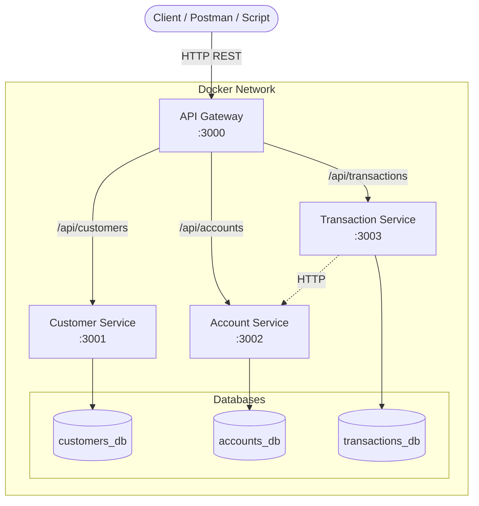
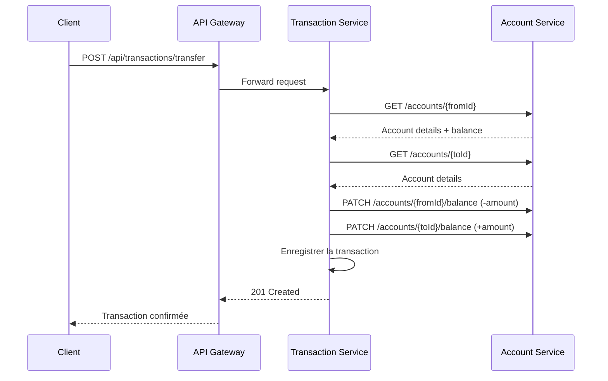
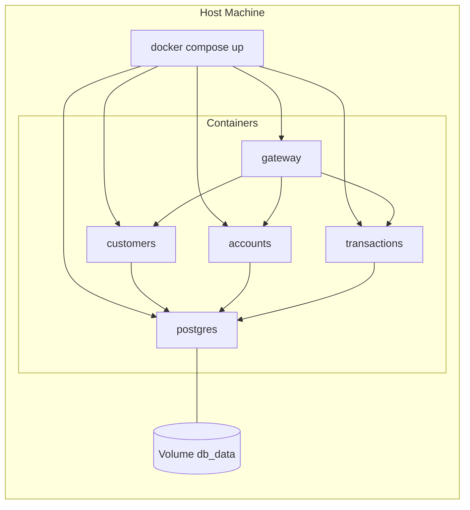

# Question 4 — DevOps et Architecture Micro-services

**Application bancaire : BanqueExpress**

---

## a. Rôle de la méthode DevOps / Architecture Micro-services

### Qu'est-ce que DevOps ?

**DevOps** (Development + Operations) est une culture et un ensemble de pratiques qui unifient le développement logiciel et les opérations informatiques. Son objectif est de **réduire le délai entre l'idée et la mise en production**, tout en garantissant la qualité et la fiabilité du logiciel.

### Rôle principal

| Dimension | Rôle |
|---|---|
| **Automatisation** | Automatiser les builds, tests, déploiements et monitoring pour éliminer les tâches manuelles répétitives |
| **Collaboration** | Briser les silos entre développeurs et administrateurs système |
| **Intégration continue (CI)** | Fusionner fréquemment le code et le valider automatiquement |
| **Déploiement continu (CD)** | Livrer le logiciel en production de façon rapide et fiable |
| **Feedback rapide** | Détecter les problèmes tôt grâce aux tests automatisés et au monitoring |

### Qu'est-ce que l'architecture Micro-services ?

L'**architecture micro-services** décompose une application monolithique en **services indépendants**, chacun responsable d'un domaine métier précis. Chaque service possède sa propre base de données, son cycle de déploiement et peut être développé par une équipe autonome.

### Étapes du cycle DevOps appliquées à ce projet

```
┌─────────────┐    ┌─────────────┐    ┌─────────────┐    ┌─────────────┐    ┌─────────────┐
│   PLAN      │───►│   CODE      │───►│   BUILD     │───►│   TEST      │───►│   RELEASE   │
│ Planifier   │    │ Développer  │    │ Compiler    │    │ Valider     │    │ Préparer    │
│ les sprints │    │ les services│    │ (Docker)    │    │ (API tests) │    │ l'image     │
└─────────────┘    └─────────────┘    └─────────────┘    └─────────────┘    └─────────────┘
                                                                                    │
       ┌────────────────────────────────────────────────────────────────────────────┘
       ▼
┌─────────────┐    ┌─────────────┐    ┌─────────────┐
│   DEPLOY    │───►│  OPERATE    │───►│   MONITOR   │
│ Déployer    │    │ Exploiter   │    │ Surveiller  │
│ (Compose)   │    │ (Docker)    │    │ (health)    │
└─────────────┘    └─────────────┘    └─────────────┘
       ▲                                      │
       └──────────── FEEDBACK ◄────────────────┘
```

1. **Plan** — Identifier les micro-services (clients, comptes, transactions) et leurs interfaces REST.
2. **Code** — Développer chaque service de façon indépendante (Node.js / Express).
3. **Build** — Construire une image Docker par service via un `Dockerfile` multi-stage.
4. **Test** — Valider les endpoints avec le script de démonstration (`scripts/demo.ps1`).
5. **Release** — Taguer les images Docker (`banqueexpress/gateway:latest`, etc.).
6. **Deploy** — Orchestrer tous les services avec `docker compose up`.
7. **Operate** — Gérer les conteneurs, volumes et réseaux Docker.
8. **Monitor** — Vérifier la santé via les endpoints `/health` de chaque service.

---

## b. Application bancaire BanqueExpress

### Identification des micro-services

| Micro-service | Port | Responsabilité | Base de données |
|---|---|---|---|
| **API Gateway** | 3000 | Point d'entrée unique, routage, agrégation | — |
| **Customer Service** | 3001 | Gestion des clients (CRUD) | `customers_db` |
| **Account Service** | 3002 | Gestion des comptes bancaires | `accounts_db` |
| **Transaction Service** | 3003 | Virements, dépôts, retraits, historique | `transactions_db` |
| **PostgreSQL** | 5432 | Persistance (une base par service) | — |

### Diagramme d'architecture globale



### Diagramme de séquence — Virement bancaire



### Diagramme de déploiement Docker



### Structure du projet

```
question-4/
├── RAPPORT.md                    ← Ce document
├── README.md                     ← Consignes du TP
├── docker-compose.yaml           ← Orchestration DevOps
├── db/
│   └── init.sql                  ← Initialisation des bases
├── scripts/
│   └── demo.ps1                  ← Script de démonstration
└── services/
    ├── gateway/                  ← API Gateway
    ├── customers/                ← Service Clients
    ├── accounts/                 ← Service Comptes
    └── transactions/             ← Service Transactions
```

### Endpoints REST

#### Customer Service (`/api/customers`)

| Méthode | Route | Description |
|---|---|---|
| GET | `/api/customers` | Lister tous les clients |
| GET | `/api/customers/:id` | Obtenir un client |
| POST | `/api/customers` | Créer un client |
| PUT | `/api/customers/:id` | Modifier un client |
| DELETE | `/api/customers/:id` | Supprimer un client |

#### Account Service (`/api/accounts`)

| Méthode | Route | Description |
|---|---|---|
| GET | `/api/accounts` | Lister tous les comptes |
| GET | `/api/accounts/:id` | Obtenir un compte |
| GET | `/api/accounts/customer/:customerId` | Comptes d'un client |
| POST | `/api/accounts` | Ouvrir un compte |
| PATCH | `/api/accounts/:id/balance` | Modifier le solde (interne) |

#### Transaction Service (`/api/transactions`)

| Méthode | Route | Description |
|---|---|---|
| GET | `/api/transactions` | Historique des transactions |
| GET | `/api/transactions/account/:accountId` | Transactions d'un compte |
| POST | `/api/transactions/deposit` | Effectuer un dépôt |
| POST | `/api/transactions/withdraw` | Effectuer un retrait |
| POST | `/api/transactions/transfer` | Effectuer un virement |

---

## c. Avantages et Inconvénients

### ✅ Avantages

#### Scalabilité indépendante
Chaque micro-service peut être mis à l'échelle séparément. Si le service de transactions reçoit plus de charge, on peut lancer plusieurs instances sans toucher aux autres services.

#### Déploiement indépendant
Une correction dans le service clients n'oblige pas à redéployer l'ensemble de l'application. Chaque service a son propre cycle de release.

#### Résilience
La défaillance d'un service (ex. notifications) n'entraîne pas l'arrêt complet de l'application bancaire. Les comptes et transactions restent fonctionnels.

#### Technologie hétérogène
Chaque équipe peut choisir la stack la plus adaptée à son domaine (Node.js, Java, Python…). Dans ce projet, Node.js/Express a été choisi pour sa légèreté.

#### Équipes autonomes
Chaque équipe possède un service de bout en bout (code, tests, déploiement), ce qui accélère le développement parallèle.

#### Automatisation DevOps
Docker et Docker Compose automatisent le build, le déploiement et la configuration. Un seul `docker compose up` lance l'ensemble de l'écosystème.

### ❌ Inconvénients

#### Complexité opérationnelle
Gérer 4 services + 3 bases de données + un gateway est nettement plus complexe qu'un monolithe. Il faut orchestrer les conteneurs, les réseaux et les volumes.

#### Latence réseau
Les appels inter-services (Transaction → Account) ajoutent de la latence par rapport à des appels de fonctions in-process dans un monolithe.

#### Cohérence des données distribuées
Un virement touche deux comptes dans le service Account et enregistre une transaction. Sans pattern Saga ou 2PC, la cohérence eventuelle peut poser problème en cas de panne partielle.

#### Debugging difficile
Tracer une requête à travers le gateway, le service de transactions et le service de comptes nécessite des outils de tracing distribué (Jaeger, Zipkin) absents dans ce projet minimal.

#### Duplication de code
Chaque service répète la configuration Express, la connexion PostgreSQL, les middlewares de santé. Un monolithe partagerait ces éléments.

#### Sécurité et gouvernance
Chaque service expose une surface d'attaque. Il faut gérer l'authentification, l'autorisation et le chiffrement inter-services, ce qui ajoute de la complexité (non implémenté ici pour rester pédagogique).

#### Coût d'infrastructure
Plus de conteneurs = plus de ressources CPU/RAM. En production, un orchestrateur (Kubernetes) devient nécessaire, augmentant les coûts et la courbe d'apprentissage.

---

## Lancer l'application

Voir les instructions dans le [README étendu](./README-EXECUTION.md).

```powershell
cd question-4
docker compose up --build
# Dans un autre terminal :
.\scripts\demo.ps1
```
